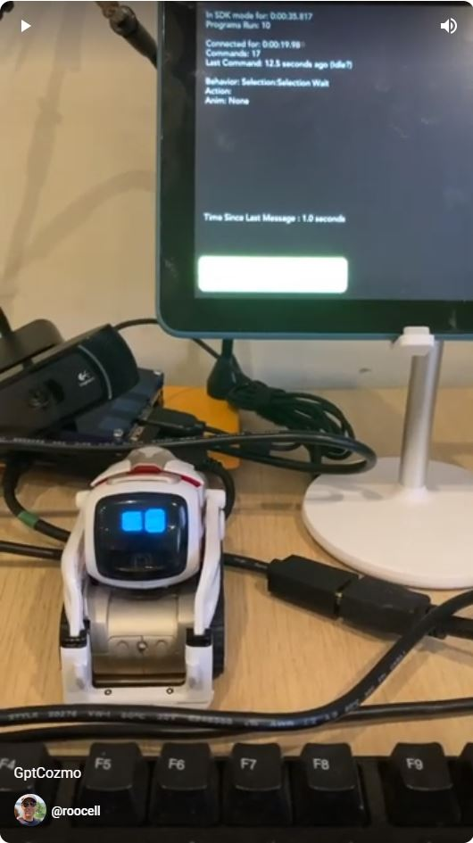

# gptCozmo
Cozmo and GPT integration on raspberry pi<BR>
<a href="https://www.youtube.com/shorts/6NITF2YtEwM"></a><BR>
This will essentially give Cozmo a giant brain when you speak to him.<BR>
- take input from a microphone<BR>
- convert it to text<BR>
- send to GPT3 for a response<BR>
- send the response to cozmo to speak<BR>
<BR>
Run the app like so <BR>

```
python app.py
```

### pycozmo
https://github.com/zayfod/pycozmo<BR>
A raspberry pi only python library to talk to cozmo. No Andriod and cozmo app required.<BR>
Supports an audio API but didn't seem to work.<BR>

### Cozmo SDK
https://github.com/anki/cozmo-python-sdk<BR>
The offical linux SDK python library. Requries an android device with Cozmo app attached to raspi via USB.<BR>
This is how to get the real cozmo voice and full functionality of cozmo.<BR>

### SpeechRecognition
A python library to take audio and transcribe it to text.

### openai GPT3
Used openai API and python library to interface with GPT3.
Create a .env file locally with 
```
export OPENAI_API_KEY = <your openai key>
```

### gtts / pyttsx3
Two text to speech libraries.


### modules required
```
pip install openai
pip install dotenv

pip install pycozmo
pip install libopenjp2-7-dev

pip install SpeechRecognition
pip install pyaudio
sudo apt-get install python3-pyaudio
sudo apt-get install flac

pip install pyttsx3
sudo apt install espeak
sudo apt install -y ffmpeg

pip install gtts
pip install pydub

sudo apt-get install python3-pil.imagetk
pip install 'cozmo[camera]'
sudo apt-get install adb

pip install pygame
sudo apt-get install libsdl2-2.0-0

```

### setup wlan1 to connect with cozmo
```
/etc/wpa_supplicant/
wpa_supplicant-wlan0.conf  wpa_supplicant-wlan1.conf

wpa_supplicant-wlan1.conf
ctrl_interface=DIR=/var/run/wpa_supplicant GROUP=netdev
update_config=1
country=CA
network={
        ssid="Cozmo_71374E"
        psk="ZZHP0SMI27GM"
}

sudo systemctl restart wpa_supplicant@wlan1.service
sudo systemctl status wpa_supplicant@wlan1.service

iwconfig
wlan1     IEEE 802.11  ESSID:"Cozmo_71374E"
          Mode:Managed  Frequency:2.462 GHz  Access Point: 5E:CF:7F:C3:8E:EC

          Bit Rate=54 Mb/s   Tx-Power=31 dBm
          Retry short limit:7   RTS thr:off   Fragment thr:off
          Power Management:on
          Link Quality=70/70  Signal level=-39 dBm
          Rx invalid nwid:0  Rx invalid crypt:0  Rx invalid frag:0
          Tx excessive retries:0  Invalid misc:0   Missed beacon:0

ifconfig
wlan1: flags=4163<UP,BROADCAST,RUNNING,MULTICAST>  mtu 1500
        inet 172.31.1.56  netmask 255.255.255.0  broadcast 172.31.1.255
        inet6 fe80::1c97:4e60:6553:b458  prefixlen 64  scopeid 0x20<link>
        ether dc:a6:32:c9:3a:08  txqueuelen 1000  (Ethernet)
        RX packets 325  bytes 53515 (52.2 KiB)
        RX errors 0  dropped 0  overruns 0  frame 0
        TX packets 424  bytes 56025 (54.7 KiB)
        TX errors 0  dropped 0 overruns 0  carrier 0  collisions 0
```

### webcam microphone
https://pimylifeup.com/raspberrypi-microphone/
```
roocell@raspberrypi:~/gptCozmo $ lsusb
Bus 002 Device 001: ID 1d6b:0003 Linux Foundation 3.0 root hub
Bus 001 Device 004: ID 413c:2005 Dell Computer Corp. RT7D50 Keyboard
Bus 001 Device 003: ID 148f:5370 Ralink Technology, Corp. RT5370 Wireless Adapter
Bus 001 Device 005: ID 046d:0821 Logitech, Inc. HD Webcam C910
Bus 001 Device 002: ID 2109:3431 VIA Labs, Inc. Hub
Bus 001 Device 001: ID 1d6b:0002 Linux Foundation 2.0 root hub
roocell@raspberrypi:~/gptCozmo $
roocell@raspberrypi:~/gptCozmo $ sudo arecord -l
**** List of CAPTURE Hardware Devices ****
card 3: U0x46d0x821 [USB Device 0x46d:0x821], device 0: USB Audio [USB Audio]
  Subdevices: 1/1
  Subdevice #0: subdevice #0

# -c 2  = stereo mic
# -d 5  = 4 second duration
arecord -D hw:3,0 -d 5 -f cd test.wav -c 2
arecord -D hw:3,0 -d 5 -fdat test.wav -c 2
```

### audio to text
https://www.assemblyai.com/<BR>
https://cloud.google.com/speech-to-text<BR>
https://github.com/touchgadget/DeepSpeech<BR>
https://github.com/flashlight/flashlight<BR>

Deepspeech and Flashlight seem heavy<BR>
Going with google - there's free portion every month.<BR>
Seems like the API key isn't required.<BR>
https://maker.pro/raspberry-pi/projects/speech-recognition-using-google-speech-api-and-python<BR>

### cozmo functions
https://pycozmo.readthedocs.io/en/stable/<BR>
cozmoclad is a low-level protocol library used by the cozmo SDK package<BR>


### Cozmo SDK
```
adb kill-server
adb start-server
adb devices

https://stackoverflow.com/questions/53887322/adb-devices-no-permissions-user-in-plugdev-group-are-your-udev-rules-wrong
roocell@raspberrypi:~/cozmo_sdk_examples_1.4.10/tutorials/01_basics $ lsusb
Bus 002 Device 001: ID 1d6b:0003 Linux Foundation 3.0 root hub
Bus 001 Device 004: ID 413c:2005 Dell Computer Corp. RT7D50 Keyboard
Bus 001 Device 003: ID 148f:5370 Ralink Technology, Corp. RT5370 Wireless Adapter
Bus 001 Device 013: ID 1949:0588 Lab126, Inc. KFONWI <<<<<<<<<<<<<<<<<<<<<<<<<
Bus 001 Device 005: ID 046d:0821 Logitech, Inc. HD Webcam C910
Bus 001 Device 002: ID 2109:3431 VIA Labs, Inc. Hub
Bus 001 Device 001: ID 1d6b:0002 Linux Foundation 2.0 root hub

sudo udevadm control --reload-rules

# then you'll get a permissions popup on the device
adb devices

# use a good USB cable!
```
